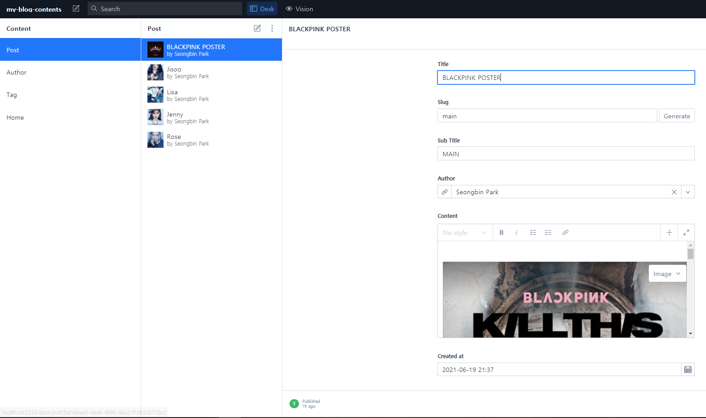
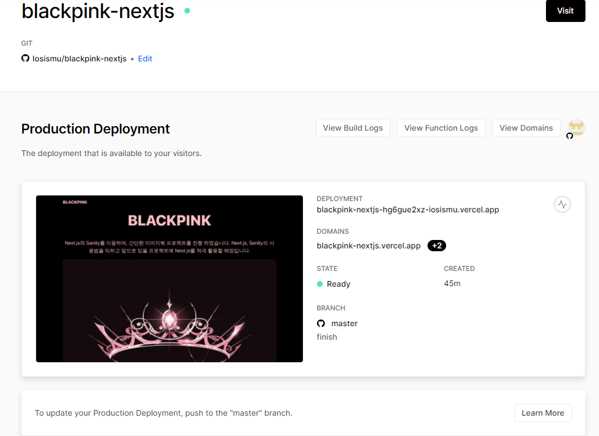

# BLACKPINK Image Book Project

[사이트 바로가기](https://blackpink-nextjs.vercel.app/)

- Next.js, Sanity를 이용해서 간단한 Gallery Project를 개발 하였습니다.

## 💡 Specs

- Next
- React
- React-dom
- antd
- sanity
- sanity/client
- sanity/block-content-to-react
- next-sanity-image

# <구현>

### 1. Next.js 앱 기능

  

- 각 컴포넌트를 클릭시 해당 컨텐츠의 이미지가 나옵니다.

### 2. Sanity Contents 구현 - 이미지, 내용, 타이틀 등등..

 

- Sanity를 이용해서 Next.js앱에 뿌려줄 Data를 양식을 만들고 Contents를 넣어서 sanity/client모듈을 이용해 Sanity와 Next.js앱을 연결 후 데이터를 가져옵니다.

# <배포>

### Vercel을 이용해서 Next.js 앱 배포

 

